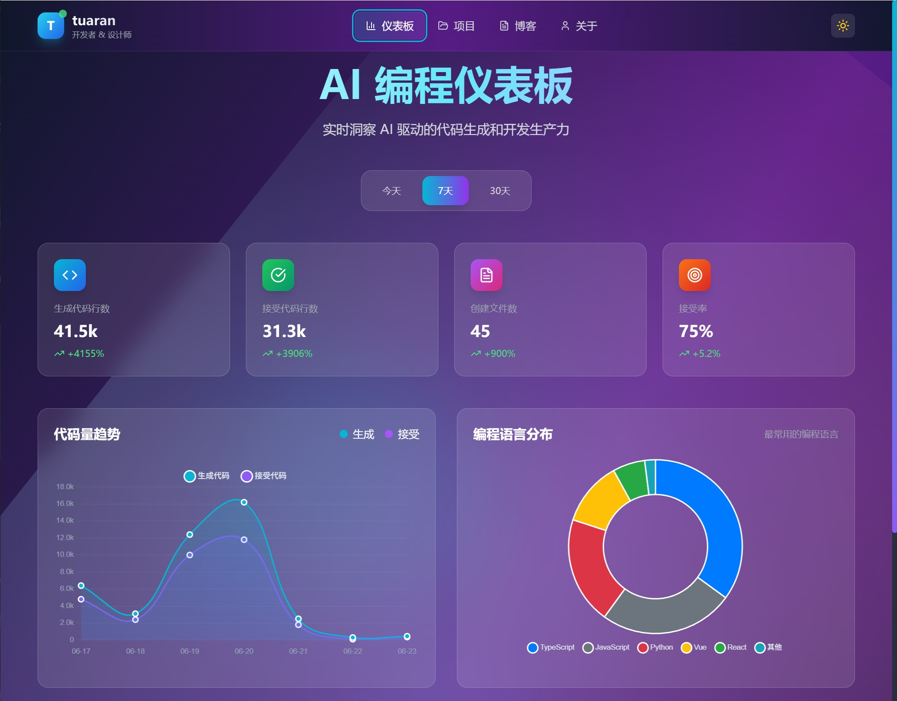

# tuaran.github.io

一个现代化的开发者主页，采用 Vue 3 + Tailwind CSS + Glassmorphism 设计风格。

## 🌐 在线预览

**🌍 网站地址：** [https://tuaran-github-io.pages.dev/](https://tuaran-github-io.pages.dev/)

## 📸 网站截图



*现代化的玻璃质感设计，支持暗色/亮色主题切换*

## 🚀 项目结构

```
tuaran.github.io/
├── index.html              # Vite 构建输出
├── dev/
│   ├── src/
│   │   ├── views/          # Dashboard.vue / Projects.vue / Blog.vue / About.vue
│   │   ├── components/     # Navbar, Footer, ChartPanel, Card, TimeSelector 等
│   │   ├── data/           # analytics.json, projects.json, blogs.json
│   │   └── router/         # 路由配置
│   ├── package.json        # 项目依赖
│   ├── vite.config.js      # Vite 配置
│   ├── tailwind.config.js  # Tailwind CSS 配置
│   └── index.html          # 开发入口文件
└── README.md
```

## 🛠 技术栈

- **Vue 3** - 渐进式 JavaScript 框架
- **Vue Router** - 官方路由管理器
- **Tailwind CSS** - 实用优先的 CSS 框架
- **Vite** - 下一代前端构建工具
- **Chart.js** - 图表库
- **Glassmorphism** - 玻璃质感设计风格

## 📦 功能模块

### ⚡ AI 编程仪表板（Dashboard）
- 统计 AI 生成 vs 接受的代码量
- 支持"今日 / 7天 / 30天"视图切换
- 可视化采用卡片 + 渐变玻璃材质
- 暗黑和亮色主题自动切换

### 🚀 GitHub 项目看板（Projects）
- 项目卡片网格，卡片悬浮抬起
- 显示 Star/Fork/更新日期
- 支持按语言或类型分类筛选
- 骨架屏+懒加载动画

### 📝 博文板块（Blog）
- 博文分为 技术 / 交易 / 生活 三类
- 卡片式排版，鼠标 hover 展示摘要
- 支持分页或无限滚动
- 点击后可弹出详情侧边栏

### 🎨 通用组件
- **Navbar** - 半透明玻璃质感背景 + 悬浮动效
- **Card** - 多用途卡片，支持光影及微交互
- **ChartPanel** - 整合 vue-chartjs，卡片中 hover 展示 tooltip
- **TimeSelector** - 切换周期时带有条形高亮滑动动画
- **Footer** - 暗/亮模式自适应

## 🚀 快速开始

### 开发环境

1. 进入开发目录：
```bash
cd dev
```

2. 安装依赖：
```bash
npm install
```

3. 启动开发服务器：
```bash
npm run dev
```

4. 打开浏览器访问 `http://localhost:5173`

### 构建部署

1. 构建生产版本：
```bash
npm run build
```

2. 构建产物将输出到项目根目录，可直接部署到 GitHub Pages

## 🎨 设计特色

- **Glassmorphism 风格** - 半透明玻璃质感背景
- **响应式设计** - 移动优先，完美适配各种设备
- **暗色模式** - 支持系统主题自动切换
- **流畅动画** - 页面切换和交互动效
- **现代化 UI** - 参考 Asana、Geex、Liquid Glass 等界面趋势

## 📁 文件说明

### 数据文件 (`dev/src/data/`)
- `analytics.json` - AI 编程统计数据
- `projects.json` - GitHub 项目信息
- `blogs.json` - 博文内容数据

### 视图组件 (`dev/src/views/`)
- `Dashboard.vue` - AI 编程仪表板
- `Projects.vue` - 项目展示页面
- `Blog.vue` - 博文列表页面
- `About.vue` - 关于页面

### 通用组件 (`dev/src/components/`)
- `Navbar.vue` - 导航栏组件
- `Footer.vue` - 页脚组件
- `Card.vue` - 卡片组件（待实现）
- `ChartPanel.vue` - 图表面板（待实现）
- `TimeSelector.vue` - 时间选择器（待实现）

## 🔧 配置说明

### Vite 配置
- 构建输出目录设置为项目根目录
- 支持 Vue 单文件组件
- 自动清空输出目录

### Tailwind CSS 配置
- 启用暗色模式
- 集成 Glassmorphism 插件
- 自定义主题扩展

## 📝 开发计划

- [x] 项目基础架构搭建
- [x] 路由配置和页面骨架
- [x] 数据文件结构设计
- [ ] 完善各个组件功能
- [ ] 实现图表可视化
- [ ] 添加交互动画
- [ ] 优化性能和用户体验

## 🤝 贡献

欢迎提交 Issue 和 Pull Request！

## 📄 许可证

MIT License

---

**TUARAN** - 用代码构建美好世界 ✨
